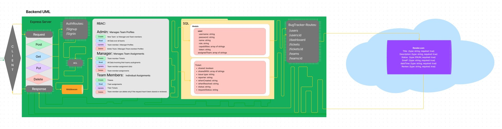
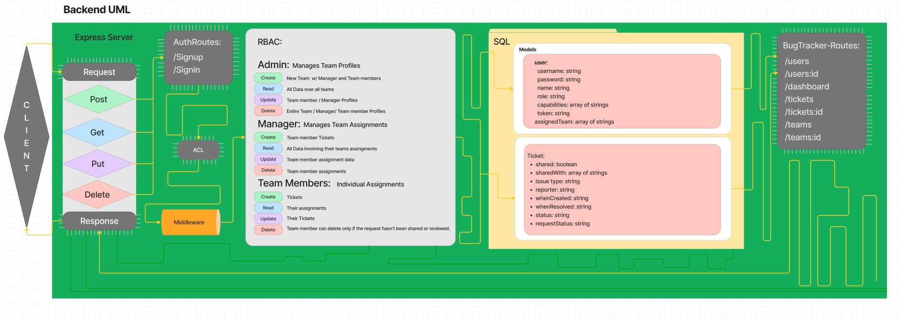
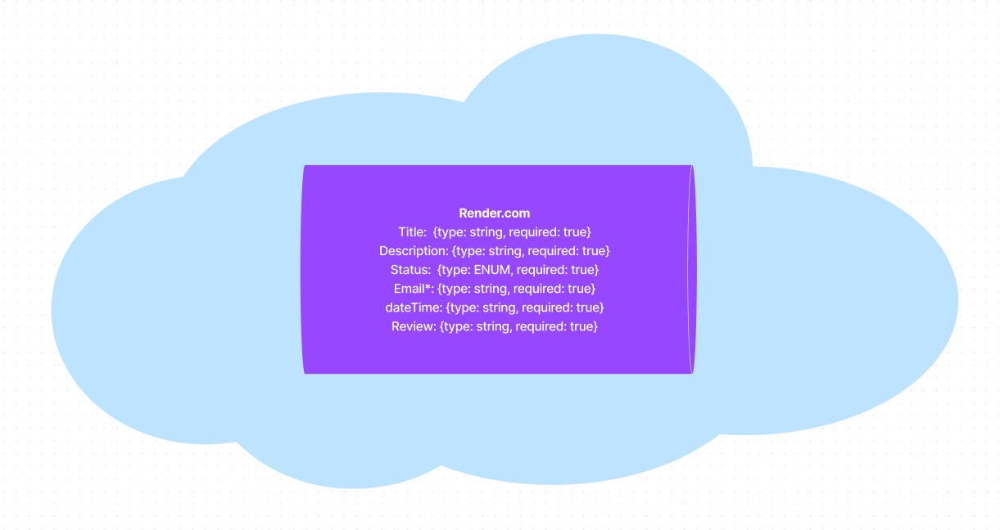

# VFT Bug Tracker

## Team: Camilla Rees, Hunter Fehr, Kenny Lino, Jacob Dang, Trace Dugar

## Description

Plant themed bug tracker that neatly display information and statistics for dev teams performance and tasks.

## Links and Resources

 [Front End Github Repository](https://github.com/chjkt-bug-tracker/bug-tracker-frontend)
 [Netlify](https://vft.netlify.app/)
 [Back End Github Repository](https://github.com/chjkt-bug-tracker/bug-tracker-backend)
 [SQL Database](https://dashboard.render.com/d/dpg-cfc5ec9gp3jokp7k2kng-a)

### Running the application

- `npm start`

### Features and Routes

- Feature 1: Once authticated all user levels have different permissions via RBAC
- Feature 2: Admin can create new teams and managers, see all data, Update team members / manger profiles, and delete them
- Feature 3: Managers can create Team member Tickets, Read all of their teams data, Update team member assignment data, and delete assignments
- Feature 4: Team Members can create tickets, read their assignments, update their tickets, and delete a ticket if the request has not been approved.
- Feature 5: Data is stored in a postgres database.

#### UML / Diagrams

